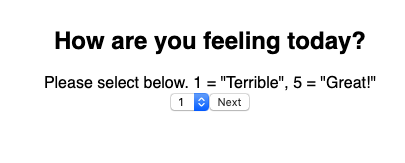
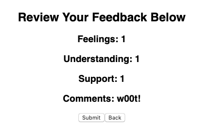

# Feedback Survey

## Description
*Duration: 2 days*

This app takes in user feedback on material they have learned. This feedback is based on 3 metrics (How user is feeling overall, how well user understands the material, if the user feels supported) as well as comments the user can optionally enter for further clarification.

## Screen Shot

## Prerequisites
- Postgres
- Node.js
- Axios
- React
- Redux

## Installation
1. Create a database named `prime_feedback`,
2. The queries in `data.sql` will allow you to create the required table to run the app properly. Postico is recommended to run the queries provided,
3. Open your chosen code editor and run `npm install`,
4. You will also want to run an `npm install` on react, redux, and react-redux,
5. Run `npm run server` in your terminal,
6. Open another terminal and run `npm run client`,
7. This last command will open a brower tab for you.

## Usage
1. You will start at the first question of the survey. Please select a response between 1-5 depending on your desired response. Click the `Next` button.
2. Repeat this step on the next two questions until you are brought to a page that asks if you wish to enter a comment. NOTE: It is not required to enter a comment, you may move on to the next page if you wish. 
3. If at any point you wish to change your previous response, you can click the `Back` button.
4. You will finally be brought to a page that shows all of your entered responses. When you are ready to submit, click the `Submit` button.
5. Thank you for submitting your feedback! If you would like to complete the survey again, click the `Leave New Feedback` button.

## Built With
- React
- Redux
- Javascript

## Acknowledgement
Thanks to Prime Digital Academy for giving me the knowledge required to make this application.

## Support
For suggestions or issues, please email me at aescott87@gmail.com
